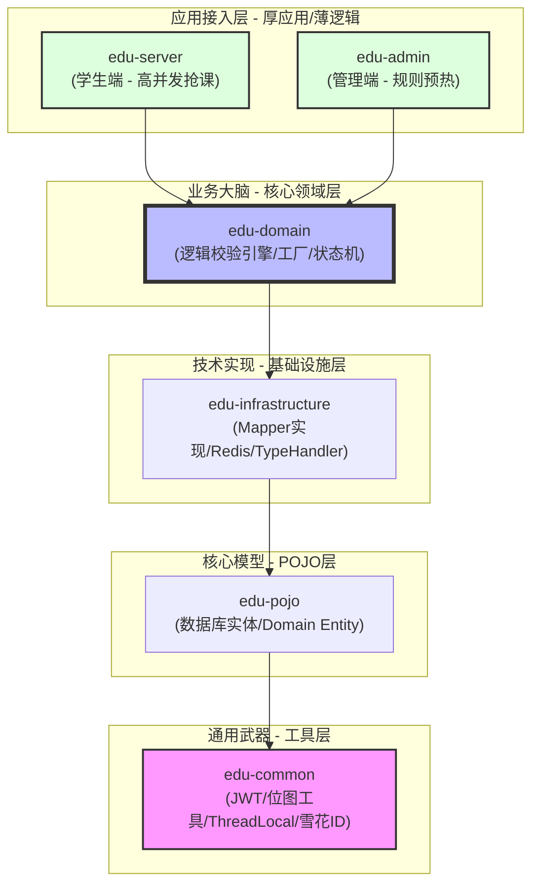
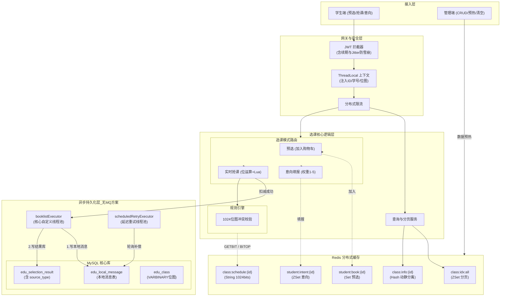

# 西电高并发选课系统

## 1. 核心设计原则

* **ID 命名隔离规范**：彻底解决逻辑 ID 与业务 ID 混淆的痛点。规范定义：**逻辑主键一律命名为 `id`（Snowflake 算法），业务主键一律以 `_no` 结尾**（如 `student_no`, `class_no`），禁止任何业务字段直呼 `id`。
* **业务状态机拆分**：根据真实校园业务，将选课抽象为三大模式：**置课（自动分发）、抢课（先到先得）、意向（权重抽奖）**。
* **无 MQ 下的异步补偿**：在不引入庞大 MQ 中间件的前提下，采用**自定义工作线程池 + 延迟调度线程池 + 阻塞队列**，配合本地消息表（`edu_local_message`）实现最终一致性。
* **防雪崩抖动（Jitter）**：在 JWT Token 刷新与 Redis 位图续期时，引入 `random.nextLong()` 随机抖动，防止海量学生在同一时刻 Token 失效导致缓存击穿。

## 上下文划分详解 (Domain Contexts)

为了应对千万级并发请求与复杂的校园业务规则，本系统严格遵循**领域驱动设计 (DDD)**，将庞杂的选课逻辑拆解为 6 个相互独立、指责明确的限界上下文（Bounded Context）。

每个领域拥有独立的数据表闭环，通过领域服务（Domain Service）进行交互，避免了传统 MVC 架构中“大杂烩”式的面条代码。

### 1. 基础域 (Identity & Org - 身份与组织架构域)

* **核心职责**：管理“谁在选课”。维护学校的静态组织架构（学院、专业）以及学生的基本学籍属性。
* **包含实体**：`edu_dept`, `edu_major`, `edu_student`
* **架构作用**：该领域的数据是**极低频修改、极高频读取**的“冷数据”。学生的年级、英语分级等属性决定了他们后续的“选课准入资格”。
* **性能设计**：核心将学生的已排课时间转化为 `VARBINARY(128)` 二进制位图，在系统流转时直接提取进入 `ThreadLocal` 与 JWT 载荷，避免业务校验时频繁查表。

### 2. 教学域 (Academic Metadata - 教学元数据域)

* **核心职责**：管理“选什么课”以及“选课的规则”。定义课程的学分、性质，以及极其复杂的“前置/互斥标签”继承树。
* **包含实体**：`edu_course`, `edu_tag`, `edu_course_tag_relation`
* **架构作用**：相当于电商系统中的 SPU（标准化产品单元）。在 DDD 中，这属于“知识级别 (Knowledge Level)”的数据。
* **性能设计**：该领域绝对不参与高并发计算。系统在选课开始前触发**Warmup（预热）机制**，将基于“物化路径 (Path)”的树形规则拍扁（Flatten）成 O(1) 的 JSON，直接存入本地缓存（Caffeine）中。

### 3. 执行域 (Scheduling & Stock - 排课与库存域)

* **核心职责**：管理“时间、地点与容量”。将抽象的课程具象化为实际可以上课的“教学班实例”。
* **包含实体**：`edu_class` (含核心字段：`time_bitmap`, `current_stock`)
* **架构作用**：相当于电商系统中的 SKU（库存保有单位），是**全系统高并发的绝对风暴中心**。所有的冲突运算、库存争抢都在此领域发生。
* **性能设计**：采用**字段级动静分离**机制。静态展示信息（老师、地点）序列化为 Hash 存入 Redis；动态信息（库存）作为独立的 Field，供 Lua 脚本进行原子级 DECR 扣减；时间位图（1024bits）转为 Redis String 供 `GETBIT`/`BITOP` 极速运算。

### 4. 选课域 (Transaction - 选课交易域)

* **核心职责**：承载选课的业务生命周期，管理学生的各种选课动作。
* **包含实体**：
  * `edu_selection_book` (预选 / 购物车)
  * `edu_selection_intent` (意向抽奖池)
  * `edu_selection_result` (最终中签/抢课结果)
  * `edu_local_message` (本地消息表)
* **架构作用**：该领域的职责是处理**状态机的流转与事务的一致性**。它不需要关心课程有多复杂，只关心“预选 -> 抽奖 -> 抢课 -> 落地”的生命周期闭环。
* **性能设计**：为了抵抗数据库的写入瓶颈，系统采用**柔性事务**设计。通过本地消息表（Local Message）接管 Redis 扣减成功的凭证，依靠双线程池异步完成最终结果（Result）的落库补偿。

### 5. 审计域 (Audit & Log - 审计与追踪域)

* **核心职责**：系统黑匣子。记录谁、在什么时间、做了什么操作、结果是什么。
* **包含实体**：`edu_admin_audit_log`, `edu_selection_log`
* **架构作用**：解决教务系统最头疼的“客诉申诉”问题（例如学生反馈：“我明明点到了但是没选上”）。提供全链路追踪能力与操作溯源。
* **性能设计**：完全与主业务流程剥离。通过 Spring Event 或异步线程记录 `trace_id` 与耗时，绝对不允许因写日志阻塞抢课的黄金时间。

### 6. 控制域 (System Configuration - 状态机与控制域)

* **核心职责**：系统的“总开关”与“方向盘”。
* **包含实体**：`edu_system_config`
* **架构作用**：管理全局选课阶段（如：`BOOKING` 预选阶段、`INTENT` 意向填报、`ROBBING` 实时抢课、`CLOSED` 维护中）。
* **性能设计**：阶段的切换决定了不同接口的降级或放行。该数据驻留在最高优先级的本地缓存中，一旦修改，系统能够在一秒内对几万人的请求进行路由重定向。

---

## 2. 核心业务场景与流程

系统根据课程性质，严格划分了不同的选课生命周期（由全局配置表 `edu_system_config` 控制）：

1. **预选阶段 (Book)**：仅针对选修课开放。学生可将心仪课程加入“预选表”（类似于购物车），此阶段不扣库存、不校验冲突，完全走 Redis 集合，极大降低数据库查表压力。
2. **意向填报与抽奖 (Intent)**：针对选修课。学生最多选 5 门，赋予 1-5 的优先级（权重）。系统在后台根据权重和志愿 ZSet 进行抽奖分配。
3. **高并发抢课 (Robbing)**：针对体育课、英语课。完全基于先到先得的原子扣减与 Redis 位图冲突校验。
4. **系统置课 (Auto)**：除了英语以外的必修课，由系统直接派发至学生课表，不开放前端抢课接口。

---

## 3. 核心架构与流转图 (System Architecture)



### 部分目录描述，不全

```plaintext
edu-course-system (Root - 根工程，管理全局依赖与版本)
├── .env                  <-- 环境变量：存储数据库/Redis密码 (本地独有，Git忽略)
├── .env.example          <-- 环境变量模板：给协作者参考的样板房
├── .gitignore            <-- 哨兵：防止敏感配置和编译产物泄露
├── pom.xml               <-- 依赖中心：定义 SpringBoot 3.x 及 MP, Redisson 等版本
├── README.md             <-- 灵魂：架构设计文档与选课模式说明
│
├── edu-common (通用能力模块)
│   └── src/main/java/com/lzh
│       ├── context       <-- StuContext (Java 17 record，ThreadLocal透传)
│       ├── enums         <-- AppResultCode (统一业务状态码)
│       ├── result        <-- Result, PageResult (统一响应体)
│       └── util          <-- 核心武器 (JwtUtil, BitMapUtils, SnowflakeIdUtil, ThreadLocalUtil)
│
├── edu-pojo (领域模型层 - 核心 DDD 划分)
│   └── src/main/java/com/lzh
│       ├── academic      <-- 教学域：Course, Tag, CourseTagRelation
│       ├── audit         <-- 审计域：AdminAuditLog, SelectionLog
│       ├── identity      <-- 身份域：Student, Dept, Major
│       ├── scheduling    <-- 执行域：EduClass (包含二进制位图字段)
│       ├── system        <-- 控制域：SystemConfig (全局开关)
│       └── transaction   <-- 选课域：SelectionResult, SelectionBook, LocalMessage
│
├── edu-infrastructure (基础设施层 - 屏蔽技术实现)
│   └── src/main/java/com/lzh
│       ├── config        <-- MyBatis-Plus, Redis, Redisson, 线程池配置
│       ├── handler       <-- TypeHandler (实现 long[] 与 VARBINARY(128) 互转)
│       ├── mapper        <-- 按照 pojo 领域建立子包 (identity, academic 等)
│       └── repository    <-- (可选) 仓储模式实现，对 Domain 屏蔽数据库细节
│
├── edu-domain (核心领域逻辑层 - 业务大脑)
│   └── src/main/java/com/lzh/domain
│       ├── transaction   <-- 选课校验引擎：SelectionCheckEngine (位图冲突逻辑)
│       ├── system        <-- 状态管理器：ConfigContext (本地缓存阶段开关)
│       └── identity      <-- 准入校验：StudentValidator (学费、评教状态校验)
│
├── edu-server
├── controller
│   └── SelectionController.java    <-- 核心选课入口
├── interceptor
│   └── JwtInterceptor.java         <-- 实现 JWT 解析与 Jitter 续期
├── service
│   └── SelectionAppService.java    <-- 编排抢课流程：查 Redis -> 调 Domain 算位图 -> 写消息表
└── task (或 async)
    └── ResultPersistenceTask.java  <-- 基于自定义线程池的异步落库任务
│
└── edu-admin (管理端应用模块 - 系统配置与监控)
└── src/main/java/com/lzh
    ├── controller
    │   ├── CourseManagerController.java  <-- 课程增删改查
    │   ├── WarmupController.java         <-- 触发 Redis 预热接口
    │   └── SystemConfigController.java   <-- 切换选课阶段 (BOOKING/ROBBING) 
    ├── service
    │   ├── WarmupAppService.java         <-- 编排预热逻辑
    │   └── ExcelImportService.java       <-- 配合 EasyExcel 批量导入学生/课程
    ├── dto
    │   └── CourseSaveDTO.java            <-- 接收前端表单
    └── vo
        └── SelectionTraceVO.java         <-- 审计日志展示对象
```



---

## 4. Redis 缓存结构设计 (动静分离)

系统摒弃了单一数据结构的臃肿，针对不同业务动作设计了精细化的 Redis Key：

| 业务分类 | Redis Key (常量) | 数据结构 | 内容与说明 | 设计意图与优化 |
| :--- | :--- | :--- | :--- | :--- |
| **分页索引** | `class:idx:all` | **ZSet** | Member: `classId`<br/>Score: `classId` | **高性能分页**：规避 MySQL 深度分页，利用 ZSet 排序快速取出 ID 后回查 Hash。 |
| **班级信息** | `class:info:{id}` | **Hash** | `info`: 不变量 JSON<br/>`stock`: 原子库存 | **字段级动静分离**：JSON 直接丢给前端展示；Stock 供抢课时 Lua 脚本极速读写。 |
| **排课位图** | `class:schedule:{id}` | **String** | 1024 bits (128 bytes) | **极致计算**：使用 String 是为了能直接调用 Redis 的 `GETBIT` / `BITOP` 指令算冲突。 |
| **学生位图** | `STUDENT_SCHEDULE_BIT:{id}`| **String** | 1024 bits | **秒级校验**：登录拦截器拉取，存入 ThreadLocal，与 JWT 同步刷新续期。 |
| **预选工具** | `student:book:{id}` | **Set** | `classId` 集合 | **轻量化购物车**：供选课前准备，不校验库存，通过 Set 快速判断是否已预选。 |
| **个人意向** | `student:intent:{id}` | **ZSet** | Member: `classId`<br/>Score: `priority` | **志愿投递**：快速展示个人已投递意向，根据 Score 限制最多 5 门及排重。 |
| **班级意向** | `class:intent:{id}` | **ZSet** | Member: `studentId`<br/>Score: `priority` | **抽奖池**：管理员触发抽奖时，直接从该池中按志愿优先级（Score）分配名额。 |

---

## 5. 核心技术实现细节

### 5.1 1024 位时间位图算法 (VARBINARY 优化)

* **业务映射**：每天 9 个时间片，一周 7 天，多个教学周。总计用 1024 个 bit 完美覆盖一学期的所有上课时间段。
* **数据库级优化**：在 V2.1 中，将 `schedule_bit_map` 由 `VARBINARY(128)` 二进制存储，且读入内存后直接转为 `long[]`。
* **运算逻辑**：判断是否冲突，仅需将学生的位图与课程位图在 Redis 或内存中进行一次 `&`（按位与）运算。如果结果大于 0，即表示时间冲突，耗时达到纳秒级。

### 5.2 JWT 防雪崩与全局异常处理

* **JWT Jitter**：在拦截器判断 Token 需要刷新时，追加 `random.nextLong(1000 * 60 * 60)` 毫秒的随机过期时间。同时使用 `connection.setEx` 对 Redis 中的学生位图做同步续期。
* **全局异常标准**：严格统一定义 `AppResultCode` 枚举类，所有业务错误（如 `REPEAT_BOOK`, `DB_WRITE_ERROR`）均抛出继承了 RuntimeException 的 `BusinessException`，由全局处理器统一封装为 `{code, msg, data}` 标准 JSON 返回前端。

### 5.3 自定义线程池的最终一致性保障

由于未引入 MQ 中间件，系统使用 **本地消息表 + 双线程池** 保障抢课落库：

1. `booklistExecutor`（工作线程池）：采用 `CPU核心数 * 2`，配合有界阻塞队列 `LinkedBlockingQueue(5000)` 防止 OOM。
2. 拒绝策略采用 `CallerRunsPolicy`，当队列满时降级由 Tomcat 线程同步执行，保证不丢数据。
3. `scheduledRetryExecutor`（延迟调度线程池）：后台定时扫描 `edu_local_message` 表中 `status=0` 的记录，进行失败重试补偿。

---

## 6. 数据库设计要点 (MySQL Schema V2.1)

| 表名 | 关键字段优化 | 设计目的 |
| :--- | :--- | :--- |
| `edu_student` | `schedule_bit_map` `VARBINARY(128)` | 优化时间位图的物理存储，提高 I/O 效率。包含乐观锁 `version`。 |
| `edu_class` | `time_bitmap`, `current_stock` | 核心教学班，库存供 Redis 预热，MySQL 留作最终备份与对账。 |
| `edu_selection_result`| `source_type` (1:置课, 2:抢课, 3:意向) | **V2.1 新增核心字段**。明确选课来源，便于后续教学评估与数据分析。 |
| `edu_selection_intent`| `priority` (1-5 权重) | **新增意向表**。承接选修课抽奖志愿池，落地持久化。 |
| `edu_local_message` | `business_id`, `payload`, `status` | 代替 MQ 实现柔性事务，保存扣减成功后的结果快照，用于异步落库。 |
| `edu_system_config` | `config_key`, `config_value` | 动态控制当前系统的开放阶段（预选 / 抢课 / 抽奖 / 关闭）。 |

## 细节处理

### 待处理

#### 使用注解+AOP+工厂自动配置log，并使用pub-sub模式异步记录log

#### 不要用@transactional

#### TimeBitMap的位图工具方法判断逻辑优化

#### 将拒绝策略从当前线程网络IO改为磁盘顺序写日志

### 已处理

#### 使用.env配置信息并列入.gitignore

#### 在vo封装位图以便于使用LongArrayTypeHandler进行位图转换

#### 使用版本号管理Class的时间位图，额有点问题，但是我已经想到办法了

#### log行为上升到pojo，因为common和infrastructure都不合适

## 快照模式解决不同版本的时间位图造成无法退课
