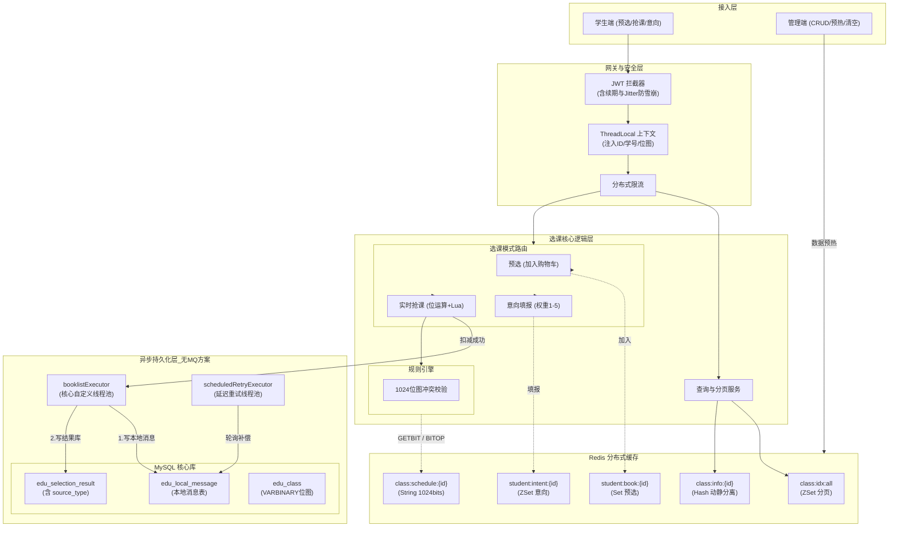

# 西电高并发选课系统

## 1. 核心设计原则与避坑经验

系统演进至 V2.1，不仅遵循 **DDD（领域驱动设计）** 思想，更结合了前期开发的“血泪史”进行了全面规范：

* **ID 命名隔离规范**：彻底解决逻辑 ID 与业务 ID 混淆的痛点。规范定义：**逻辑主键一律命名为 `id`（Snowflake 算法），业务主键一律以 `_no` 结尾**（如 `student_no`, `class_no`），禁止任何业务字段直呼 `id`。
* **业务状态机拆分**：根据真实校园业务，将选课抽象为三大模式：**置课（自动分发）、抢课（先到先得）、意向（权重抽奖）**。
* **无 MQ 下的异步补偿**：在不引入庞大 MQ 中间件的前提下，采用**自定义工作线程池 + 延迟调度线程池 + 阻塞队列**，配合本地消息表（`edu_local_message`）实现最终一致性。
* **防雪崩抖动（Jitter）**：在 JWT Token 刷新与 Redis 位图续期时，引入 `random.nextLong()` 随机抖动，防止海量学生在同一时刻 Token 失效导致缓存击穿。

---

## 2. 核心业务场景与流程

系统根据课程性质，严格划分了不同的选课生命周期（由全局配置表 `edu_system_config` 控制）：

1. **预选阶段 (Book)**：仅针对选修课开放。学生可将心仪课程加入“预选表”（类似于购物车），此阶段不扣库存、不校验冲突，完全走 Redis 集合，极大降低数据库查表压力。
2. **意向填报与抽奖 (Intent)**：针对选修课。学生最多选 5 门，赋予 1-5 的优先级（权重）。系统在后台根据权重和志愿 ZSet 进行抽奖分配。
3. **高并发抢课 (Robbing)**：针对体育课、英语课。完全基于先到先得的原子扣减与 Redis 位图冲突校验。
4. **系统置课 (Auto)**：除了英语以外的必修课，由系统直接派发至学生课表，不开放前端抢课接口。

---

## 3. 核心架构与流转图 (System Architecture)

---

## 4. Redis 缓存结构设计 (动静分离)

系统摒弃了单一数据结构的臃肿，针对不同业务动作设计了精细化的 Redis Key：

| 业务分类 | Redis Key (常量) | 数据结构 | 内容与说明 | 设计意图与优化 |
| :--- | :--- | :--- | :--- | :--- |
| **分页索引** | `class:idx:all` | **ZSet** | Member: `classId` Score: `classId` | **高性能分页**：规避 MySQL 深度分页，利用 ZSet 排序快速取出 ID 后回查 Hash。 |
| **班级信息** | `class:info:{id}` | **Hash** | `info`: 不变量 JSON `stock`: 原子库存 | **字段级动静分离**：JSON 直接丢给前端展示；Stock 供抢课时 Lua 脚本极速读写。 |
| **排课位图** | `class:schedule:{id}` | **String** | 1024 bits (128 bytes) | **极致计算**：使用 String 是为了能直接调用 Redis 的 `GETBIT` / `BITOP` 指令算冲突。 |
| **学生位图** | `STUDENT_SCHEDULE_BIT:{id}`| **String** | 1024 bits | **秒级校验**：登录拦截器拉取，存入 ThreadLocal，与 JWT 同步刷新续期。 |
| **预选工具** | `student:book:{id}` | **Set** | `classId` 集合 | **轻量化购物车**：供选课前准备，不校验库存，通过 Set 快速判断是否已预选。 |
| **个人意向** | `student:intent:{id}` | **ZSet** | Member: `classId` Score: `priority` | **志愿投递**：快速展示个人已投递意向，根据 Score 限制最多 5 门及排重。 |
| **班级意向** | `class:intent:{id}` | **ZSet** | Member: `studentId` Score: `priority` | **抽奖池**：管理员触发抽奖时，直接从该池中按志愿优先级（Score）分配名额。 |

---

## 5. 核心技术实现细节

### 5.1 1024 位时间位图算法 (VARBINARY 优化)

* **业务映射**：每天 9 个时间片，一周 7 天，多个教学周。总计用 1024 个 bit 完美覆盖一学期的所有上课时间段。
* **数据库级优化**：在 V2.1 中，将 `schedule_bit_map` 由 `VARCHAR(256)` 彻底**优化为 `VARBINARY(128)` 二进制存储**，节省了一半存储空间，且读入内存后直接转为 `byte[]`。
* **运算逻辑**：判断是否冲突，仅需将学生的位图与课程位图在 Redis 或内存中进行一次 `&`（按位与）运算。如果结果大于 0，即表示时间冲突，耗时达到纳秒级。

### 5.2 JWT 防雪崩与全局异常处理

* **JWT Jitter**：在拦截器判断 Token 需要刷新时，追加 `random.nextLong(1000 * 60 * 60)` 毫秒的随机过期时间。同时使用 `connection.setEx` 对 Redis 中的学生位图做同步续期。
* **全局异常标准**：严格统一定义 `AppResultCode` 枚举类，所有业务错误（如 `REPEAT_BOOK`, `DB_WRITE_ERROR`）均抛出继承了 RuntimeException 的 `BusinessException`，由全局处理器统一封装为 `{code, msg, data}` 标准 JSON 返回前端。

### 5.3 自定义线程池的最终一致性保障

由于未引入 MQ 中间件，系统使用 **本地消息表 + 双线程池** 保障抢课落库：

1. `booklistExecutor`（工作线程池）：采用 `CPU核心数 * 2`，配合有界阻塞队列 `LinkedBlockingQueue(5000)` 防止 OOM。
2. 拒绝策略采用 `CallerRunsPolicy`，当队列满时降级由 Tomcat 线程同步执行，保证不丢数据。
3. `scheduledRetryExecutor`（延迟调度线程池）：后台定时扫描 `edu_local_message` 表中 `status=0` 的记录，进行失败重试补偿。

---

## 6. 数据库设计要点 (MySQL Schema V2.1)

| 表名 | 关键字段优化 | 设计目的 |
| :--- | :--- | :--- |
| `edu_student` | `schedule_bit_map` `VARBINARY(128)` | 优化时间位图的物理存储，提高 I/O 效率。包含乐观锁 `version`。 |
| `edu_class` | `time_bitmap`, `current_stock` | 核心教学班，库存供 Redis 预热，MySQL 留作最终备份与对账。 |
| `edu_selection_result`| `source_type` (1:置课, 2:抢课, 3:意向) | **V2.1 新增核心字段**。明确选课来源，便于后续教学评估与数据分析。 |
| `edu_selection_intent`| `priority` (1-5 权重) | **新增意向表**。承接选修课抽奖志愿池，落地持久化。 |
| `edu_local_message` | `business_id`, `payload`, `status` | 代替 MQ 实现柔性事务，保存扣减成功后的结果快照，用于异步落库。 |
| `edu_system_config` | `config_key`, `config_value` | 动态控制当前系统的开放阶段（预选 / 抢课 / 抽奖 / 关闭）。 |

# 细节处理
